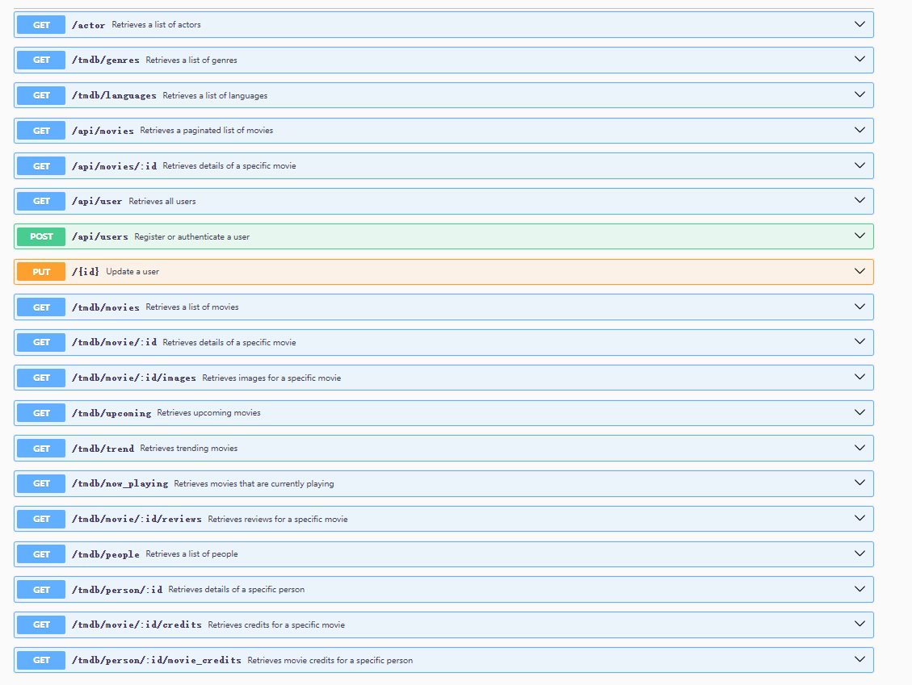

# Assignment 2 - Web API

__Name:__ Xiang Li 20095236

## Features

+ __Movies Genres:__ The database stores the genre data of movies, and implements the movie genre interface.
+ __Movies Languages:__ The movie language related data is stored in the database, and the language acquisition interface is implemented.
+ __Movies Service:__ Handles various requests related to movies, integrates tmdb data acquisition function (e.g., movies, actors, credits detail, etc.)
+ __Favorites:__ The favorites array is added to the user schema to store the favorites information of different users.

## Setup requirements

Clone the repository: git clone <https://github.com/Onion-L/react-movie-app.git>
Install dependencies: npm install
Initialise the database: npm run dev
Start the application: npm run start

## API Configuration

Describe any configuration that needs to take place before running the API. For example, creating an `.env` file and what variables to put in it. Give an example of how this might be done.

>NODE_ENV=development
PORT=8080
HOST=localhost
MONGO_DB=MONGO_DB_URL
TMDB_KEY=TMDB_KEY
SECRET=JWT_SECRET_KEY

## API Design

+ /api/movies | GET | Gets a list of movies
+ /api/movies/{movieid} | GET | Gets a single movie
+ /api/movies/{movieid}/reviews | GET | Get all reviews for movie
+ /api/movies/{movieid}/reviews | POST | Create a new review for Movie

## Security and Authentication

Give details of authentication/security implemented on the API (e.g. passport/sessions). Indicate which routes are protected.

## Integrating with React App

Describe how you integrated your React app with the API. List the views that use your Web API instead of the TMDB API. Describe any other updates to the React app from Assignment One.

## Independent learning (if relevant)

Briefly explain any non-standard features developed for the app. 